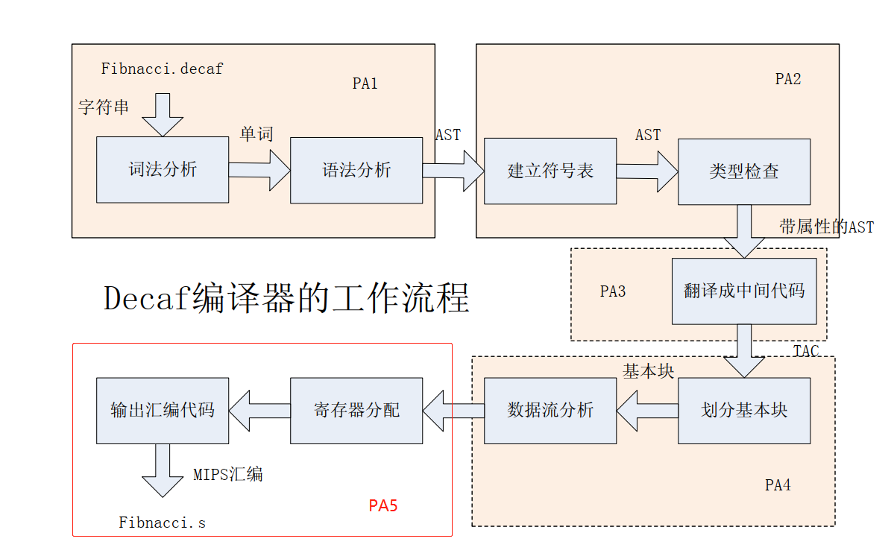

# Lab of Compiler Theory Course

做“2016级翁家翌”版实验，年份：2018年秋

- <https://github.com/Trinkle23897/decaf-complier>  <https://github.com/jmcjmmcjc/decaf-complier>
- <https://github.com/Harry-Chen/decaf_PA>  <https://github.com/jmcjmmcjc/decaf_PA>
- <https://github.com/Harry-Chen/compiler-labs>

其他REFs:

- <https://github.com/decaf-lang/minidecaf>
- <https://decaf-lang.github.io/minidecaf-tutorial/>
- <https://github.com/decaf-lang/decaf>
- <https://github.com/decaf-lang/decaf-2019-project>
- <https://decaf-lang.gitbook.io/decaf-book>
- <https://decaf-project.gitbook.io/decaf-2019/overview>

## Overview



## PA1A

词法分析、 语法分析及抽象语法树生成

### 实验⼀

问题描述

```text
识别形如 scopy(ident, expr) 的语句
```

### 实验⼆

问题描述

```text
class 之前增加关键字 sealed
```

### 实验三

问题描述

```text
串⾏条件卫⼠： if { E1 : S1 ||| E2 : S2 ||| ... ||| En : Sn } 。 n 可以为 0 。
```

### 实验四

问题描述

```text
识别 var ident
```

### 实验五

1. 问题描述

    ```text
    ⽀持数组常量，形如 [1, 2, 3]
    ```

2. 问题描述

    ```text
    识别形如 Expr %% intConst 的语句
    ```

3. 问题描述

    ```text
    识别 Expr ++ Expr
    ```

4. 问题描述

    ```text
    实现数组分⽚的识别： Expr[Expr : Expr]
    ```

5. 问题描述

    ```text
    识别 Expr [ Expr ] default Expr
    ```

6. 问题描述

    ```text
    识别Python⻛格数组： [ Expr for ident in Expr <if BoolExpr> ]
    ```

7. 问题描述

    ```text
    识别形如 foreach (var ident in Expr <while Expr>) Stmt 或者把 var 改成 Type 的语句
    ```

## PA1B

词法分析、 语法分析及抽象语法树生成

在 PA1-A 中，我们借助 LEX 和 YACC 完成了 Decaf 的词法、语法分析。在这一部分，我们的任务与 PA1-A 相同，但不再使用 YACC，而是手工实现自顶向下的语法分析， 并支持一定程度的错误恢复。

## PA2

Decaf 编译器的另一项关键工作————**语义分析**

## PA3

翻译成中间代码

## PA4

数据流分析与代码优化

## PA5

目标代码生成
